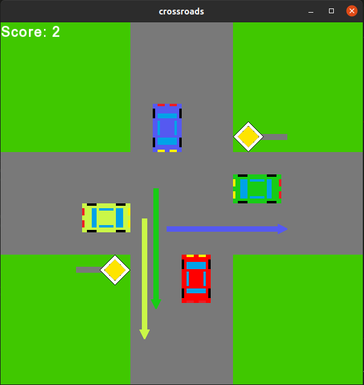
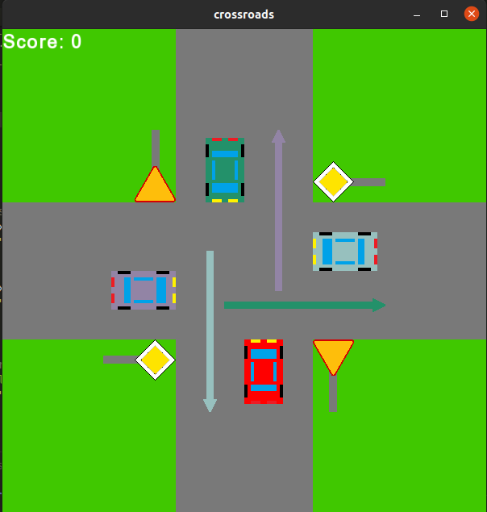
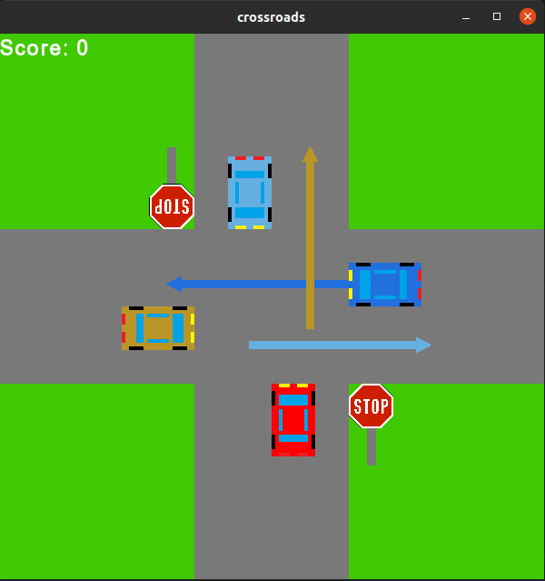

# Crossroads-engine-simulator
 

An endless game in which the player (red car on the bottom lane) must pass as many crossroads in a row as possible!

Arrows indicate where other cars intend to go. They have matching colors!

### Dependencies:
* SFML 2.5

### Controls:
* left, up, right arrow - go to the corresponding road
* down arrow - regenerate the crossroad

 
 
